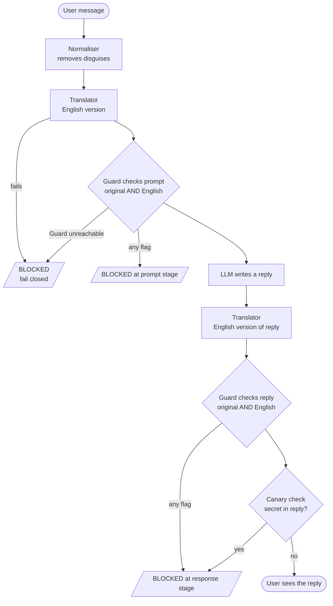

<div align="center">

# 🛡️ Zuri Watch

### A guarded LLM assistant that checks every message and reply, in any language, and refuses to fail open.


**Hosted by CAIRLab-KNUST** · **Team:** Zuko Gutyungwa · Symphorose Tshibombi · Clen Bongane (WeThinkCode_)

[The challenge](#-the-challenge) · [Findings](#-what-we-found) · [What we built](#-what-we-built) · [Quick start](#-quick-start) · [Commands](#-commands) · [Troubleshooting](#-troubleshooting)

</div>

---

> **In one line:** we tested the SecureAI Guard systematically, found it holds up well, and built a layer around it that checks messages and replies in any language, refuses to fail open, and catches leaked secrets. We are also open about the one result we could not confirm.

## 📊 At a glance

| | |
|---|---|
| 🌍 **Language layer** | Guard sees the original *and* an English translation |
| 🚪 **Fail closed** | Guard or translator down → message blocked |
| 🐤 **Canary check** | Hidden fake secret exposes leaked instructions |
| 🧹 **Normaliser** | Strips hidden characters, look-alikes and encodings |
| ⏱️ **Cost** | ~3.6s (Guard alone) → ~6.1s (full protection), about **+2.5s** |
| 🧪 **Tests** | 17 offline tests, no token, key or quota needed |

## 🎯 The challenge

The organizers gave each team:

- the **SecureAI Guard API**, which reads text and says whether it should be allowed through, and
- an **LLM API**, a language model that answers messages.

Our task: **find a weakness in the Guard ourselves**, then build a small system that adds an extra layer of protection. The prototype had to:

1. ✅ show a weakness in the Guard,
2. ✅ show our system addressing it,
3. ✅ run as a working demo with the Guard and the LLM.

Judging is by people on demo day, on innovation and creativity. There is no automated scoring.

## 🔬 How we worked

1. **Listed where the Guard might be weak:** multi-turn splitting, disguised text (encodings, hidden characters, look-alike letters), other languages, behaviour when the Guard is down, and leaks in model replies.
2. **Built a probe** (`probe.py`) that sends test messages and records each verdict and `request_id`.
3. **Built a guarded assistant** (`pipeline.py`) that checks every message before the model and every reply before the user.
4. **Ran the probe against the real Guard.** It blocked almost everything. One Twi test sentence got through.
5. **Built a language layer** (`translator.py`, `layer.py`) so the Guard judges text in the language it handles best.
6. **Tested live and checked our own finding.** The Twi sentence did not hold up as a clear attack, so we report it as *unconfirmed*.
7. **Wrote offline tests** (`tests/`) that check the layer's logic without network or shared quota.

## 🔍 What we found

### ✅ The Guard is strong

It blocked a plain prompt injection, encoded and disguised versions of it, a multi-turn attempt, the same injection in isiZulu, a reply leaking a secret, and a reply containing a card number.

### ⚠️ One Twi sentence got through, unconfirmed

It passed the Guard on its own twice (`request_id` `31e9bde94251` and `e573aa38d5d9`). We first read this as a coverage gap. On checking further:

- our Twi sentence was a rough translation, and the model translated it back as something harmless ("the initial setup will show you all the details of your system"),
- the model did not act on it and replied politely without leaking anything,
- a clearer Twi version was **blocked** by the Guard on its own (`request_id` `04b3e94790e0`).

So the Twi result is **unconfirmed**. It may be awkward wording rather than a blind spot, and we could not get a fluent speaker to settle it. We would rather say that than overclaim.

## 🧱 What we built

Our layer sits around the Guard. The Guard stays the main check; the layer adds what it cannot do alone.

| Part | What it does | Why |
|------|--------------|-----|
| 🌍 **Language layer** (`translator.py`, `layer.py`) | Translates each message into English, then sends **both** versions to the Guard. Either flagged → blocked. Replies get the same treatment. | A safety check is only as good as its understanding of the language. |
| 🚪 **Fail closed** | Guard or translator unreachable → message blocked. | Simple apps often fail open, so an outage quietly switches off all protection. |
| 🐤 **Canary check** | A fake secret (`CANARY-7F3A-DEMO`) hides in the assistant's instructions; any reply containing it is blocked. | Reveals a tricked model even if the reply looks harmless. |
| 🧹 **Normaliser** (`normalizer.py`) | Removes hidden characters, fixes look-alike letters, decodes encodings, checks each version. | The Guard catches these today; this keeps us covered if that changes. |
| ⚖️ **Before/after modes** | `--guard-only` and `--compare` in `pipeline.py` and `probe.py`. | Shows exactly what our layer adds. |
| 🧪 **Offline tests** (`tests/`) | 17 tests with stand-ins for Guard and LLM. | Proves the logic with no token, key or quota. |

**The translator protects itself too:**

- If it refuses to translate, we treat that as a warning sign and block.
- If the translation is suspiciously short, we assume tampering and block.
- A message cannot break out of the translator's input wrapper.
- The translator holds no secrets, so there is nothing to leak from it.

## 🔄 How a message travels



## 📁 The files

| File | What it is |
|------|------------|
| `pipeline.py` | The guarded assistant. **This is what we demo.** |
| `layer.py` | Our protection layer; decides what is safe. |
| `translator.py` | Translates to English and checks the translation can be trusted. |
| `normalizer.py` | Removes disguises from text. |
| `guard.py` | Talks to the SecureAI Guard. Spaces calls out, retries once if rate limited. |
| `llm.py` | Talks to the language model (replies and translation). |
| `probe.py` | Our testing tool. Sends the test set and reports what gets through. |
| `config.py` | Reads settings from `.env`. |
| `tests/test_layer.py` | Offline tests for the layer. |
| `.env.example` | Template for your settings file. |
| `.gitignore` | Keeps `.env` (your secrets) out of Git. |

## 🚀 Quick start

### Prerequisites

- [ ] **Python 3**. No packages to install. Check with `py --version` (Windows) or `python3 --version` (Mac/Linux). If Windows says Python was not found, install it from python.org and tick **Add Python to PATH**.
- [ ] **Git**
- [ ] **The team token** (`sai_...`, from the organizers' email)
- [ ] **The LLM key** (`sk-proj-...`, from the challenge brief)

> 💡 On Windows use `py`. On Mac or Linux use `python3`. Commands below show `py`; swap it if needed.

### 1. Get the code

```bash
git clone https://github.com/ZukoG/zuri-watch-guard.git
cd zuri-watch-guard
```

Already have it? Run `git pull` instead.

> 🪟 **Windows tip:** open the folder in File Explorer, click the address bar, type `powershell` and press Enter.

### 2. Create your settings file (`.env`)

This holds your secrets. It is in `.gitignore`, so it never goes to GitHub.

<details open>
<summary><b>🪟 Windows (PowerShell), recommended</b></summary>

Put your real token and key in place of the placeholders, then paste all five lines at once:

```powershell
@"
GUARD_URL=https://secureai-guard-598609297408.europe-west4.run.app
GUARD_TOKEN=sai_YOUR_TEAM_TOKEN
LLM_API_KEY=sk-proj-YOUR_KEY
"@ | Set-Content -Encoding ascii .env
```

</details>

<details>
<summary><b>🪟 Windows (Notepad)</b></summary>

```
copy .env.example .env
notepad .env
```

Fill in the values, press **Ctrl+S**, then close. If you skip the save, every call fails with `401 unauthorized`.

</details>

<details>
<summary><b>🍎 Mac / Linux</b></summary>

```bash
cp .env.example .env
nano .env
```

Fill in the values, save with Ctrl+O, Enter, and exit with Ctrl+X.

</details>

> ⚠️ The LLM key in the brief PDF is split across two lines. Make sure it ends up as **one unbroken string with no spaces**.

### 3. Check everything works

```bash
py -m unittest discover tests
```

This uses no token, key or quota. It should end with `OK`.

Then check your token with the Guard:

<details>
<summary><b>🪟 Windows</b></summary>

```powershell
curl.exe -s -H "Authorization: Bearer sai_YOUR_TEAM_TOKEN" `
  "https://secureai-guard-598609297408.europe-west4.run.app/v1/usage"
```

</details>

<details>
<summary><b>🍎 Mac / Linux</b></summary>

```bash
curl -s -H "Authorization: Bearer sai_YOUR_TEAM_TOKEN" \
  "https://secureai-guard-598609297408.europe-west4.run.app/v1/usage"
```

</details>

A good token shows your team name, for example:

```json
{"daily_limit":1000,"per_minute_limit":30,"team":"Zuri Watch","used_today":0}
```

## ⌨️ Commands

### Quick reference

| Command | What it does | Quota |
|---------|--------------|-------|
| `py -m unittest discover tests` | Offline tests of the layer | None |
| `py pipeline.py "message"` | One message, full protection | A few calls |
| `py pipeline.py --guard-only "message"` | Same message, Guard alone | 2 calls |
| `py pipeline.py --compare "message"` | Guard alone, then full protection | A few calls |
| `py pipeline.py --compare` | The 4 built-in examples, both ways ⭐ | ~20 calls |
| `py pipeline.py` | The 4 built-in examples, full protection only | ~12 calls |
| `py probe.py` | Full test set against the Guard alone | 14 calls |
| `py probe.py --with-layer` | Full test set with our layer | ~30 calls |
| `py probe.py --compare` | Full test set, both ways, side by side | ~45 calls |

> 📌 The team shares **30 Guard calls a minute and 1,000 a day**. Scripts space their calls out automatically, but agree who runs the big tests.

### `pipeline.py`: the guarded assistant

<details>
<summary><b>Full protection (the normal mode)</b></summary>

```bash
py pipeline.py "What is the capital of Ghana?"
```

The message goes through the whole system shown above. You see each check, the reply, and how long it took.

</details>

<details>
<summary><b>Guard alone (<code>--guard-only</code>)</b></summary>

```bash
py pipeline.py --guard-only "What is the capital of Ghana?"
```

Only the SecureAI Guard checks the message and reply. Our translator, normaliser and canary check are off. Use this to see what the Guard does on its own.

</details>

<details>
<summary><b>Before and after (<code>--compare</code>) ⭐</b></summary>

```bash
py pipeline.py --compare "What is the capital of Ghana?"
```

**Why it exists:** the challenge asks us to show what our system adds on top of the Guard. `--compare` runs the same message twice, first `[GUARD ONLY]`, then `[FULL PROTECTION]`, with the time each took.

**What to look for:**

- a `translator:` line under `[FULL PROTECTION]`, the English version the Guard also checked,
- whether each run ended in `ASSISTANT:` (allowed) or `BLOCKED`,
- the `took ...s` line, which shows the cost of the extra checks.

**Built-in examples:** leave the message out to run four ready-made cases (a normal English question, an English injection, our unconfirmed Twi test sentence, and a normal Twi question):

```bash
py pipeline.py --compare
```

This is the quickest way to show the whole system working.

</details>

### `probe.py`: the testing tool

```bash
py probe.py                # Guard alone (how we did our original testing)
py probe.py --with-layer   # Guard plus our layer
py probe.py --compare      # both, side by side, for every test
```

Each test prints a verdict (`ALLOWED` or `BLOCKED`) and its `request_id`. At the end you get a summary of attacks that got through and harmless messages wrongly blocked. `--compare` takes a couple of minutes because it spaces Guard calls to stay under the limit.

> **Why `request_id` matters:** every Guard check has a unique ID, so any result we quote can be traced back and proven.

### `TRANSLATE_MODE`: when to translate

Set in `.env` (defaults to `always` if the line is missing):

| Setting | What happens | When to use it |
|---------|--------------|----------------|
| `always` | Every message and reply is translated. | **Default.** Safest. |
| `auto` | Messages that look like plain English skip translation. | Faster, but mixing languages could dodge the check. |
| `off` | Never translate. | To see the system without the language layer. |

## 🎬 "I want to..." scenarios

<details>
<summary><b>...check the system works without using any quota</b></summary>

```bash
py -m unittest discover tests
```

</details>

<details>
<summary><b>...show the demo before and after</b></summary>

```bash
py pipeline.py --compare
```

</details>

<details>
<summary><b>...try my own message</b></summary>

```bash
py pipeline.py --compare "type your message here"
```

</details>

<details>
<summary><b>...see how much quota the team has used today</b></summary>

Run the `curl` command from [step 3](#3-check-everything-works).

</details>

<details>
<summary><b>...prove it fails closed when the Guard is down</b></summary>

Point the Guard address somewhere that does not exist, for this terminal only.

**Windows (PowerShell):**

```powershell
$env:GUARD_URL="https://guard-is-down.invalid"
py pipeline.py "What is the capital of Ghana?"
Remove-Item Env:GUARD_URL
```

**Mac / Linux** (affects only that one command):

```bash
GUARD_URL=https://guard-is-down.invalid python3 pipeline.py "What is the capital of Ghana?"
```

You should see `BLOCKED ... guard error`: nothing reached the model while the Guard was unreachable.

</details>

<details>
<summary><b>...prove it fails closed when the translator is down</b></summary>

The same idea with the LLM key:

```powershell
$env:LLM_API_KEY="not-a-real-key"
py pipeline.py "What is the capital of Ghana?"
Remove-Item Env:LLM_API_KEY
```

You should see `translator unavailable, failing closed`.

</details>

<details>
<summary><b>...run without the language layer for a moment</b></summary>

```powershell
$env:TRANSLATE_MODE="off"
py pipeline.py "What is the capital of Ghana?"
Remove-Item Env:TRANSLATE_MODE
```

</details>

<details>
<summary><b>...get my teammates' latest changes</b></summary>

```bash
git pull
```

</details>

## 📖 Reading the output

| You see | It means |
|---------|----------|
| `[GUARD ONLY]` / `[FULL PROTECTION]` | Which mode this run used. |
| `normaliser: ...` | The normaliser found and removed a disguise. |
| `translator: ...` | The English version the Guard also checked. |
| `prompt passed the checks (request_id ...)` | Every check on the message said it was safe. |
| `ASSISTANT: ...` | The reply passed every check and was shown. |
| `BLOCKED at the prompt stage: ...` | Stopped before reaching the model. The reason names the check. |
| `BLOCKED at the response stage: ...` | The model replied, but the reply was stopped before the user saw it. |
| `caught on the English translation` | The Guard flagged the English version, not the original: the language layer doing its job. |
| `failing closed` | Something could not be reached, so we blocked rather than take a risk. |
| `WARNING: this reply leaked the planted secret` | The canary appeared in a reply nothing stopped (only possible in `--guard-only`). |
| `took 3.6s` | Time for that run, excluding rate-limit pauses. |

## 🚧 What we could not solve

- **The Twi question is open.** One Twi sentence got past the Guard alone, but we could not confirm with a fluent speaker that it is a real attack, and a clearer version was blocked. Reported as unconfirmed.
- **Translation is weakest where it matters most.** Our layer depends on the translator understanding the language. For lower-resource languages like Twi, models translate less reliably, as we saw ourselves.
- **It costs time and quota.** About 2.5 extra seconds per message, and up to three Guard calls instead of one.
- **`auto` mode can be dodged** by mixing languages, which is why `always` is the default.

### 🔭 With more time

- Build a test set with native speakers across several Ghanaian languages
- Try a dedicated translation model
- Share our results with the Guard's makers

## 🛠️ Troubleshooting

| You see | What to do |
|---------|------------|
| `python3` not recognised, or "Python was not found" (Windows) | Use `py` instead. If that fails, install Python from python.org with "Add Python to PATH". |
| `probe.py` not recognised | Run it through Python: `py probe.py`. |
| `Missing settings: ...` | No `.env` in this folder. Create it ([step 2](#2-create-your-settings-file-env)) next to the `.py` files. |
| `401 unauthorized` from the Guard | Token is wrong or still the placeholder, usually because Notepad was not saved. Recreate `.env` with the PowerShell command in step 2. |
| `LLM HTTP 401 ... Incorrect API key` | LLM key is wrong or still the placeholder. Check it is one unbroken string. |
| `translator unavailable, failing closed` | The LLM could not be reached. Check `LLM_API_KEY` and your internet. |
| `not a git repository` | Wrong folder. If you unzipped, the project may be one folder deeper. Go into the folder that holds `README.md`. |
| `429 rate_limited` or `daily_quota_exceeded` | The shared limit is used up. Wait a minute, or check usage (step 3). |
| `git push` rejected (non-fast-forward) | Someone pushed first. Run `git pull`, then `git push`. |

## 🔐 Keeping secrets safe

- [ ] The token and LLM key live **only** in `.env`. Never put them in code, slides, screenshots, chat messages or a screen recording.
- [ ] Before pushing, `git ls-files` should list `.env.example` but **never** `.env`.
- [ ] When recording or presenting, open a fresh terminal so no earlier command with a key is visible, and never open `.env` on screen.
- [ ] All test data in this project is made up.

---

<div align="center">

**Zuri Watch** · SecureAI Hackathon 2026 · CAIRLab-KNUST

*We'd rather report an honest "unconfirmed" than an impressive claim we can't prove.*

</div>
